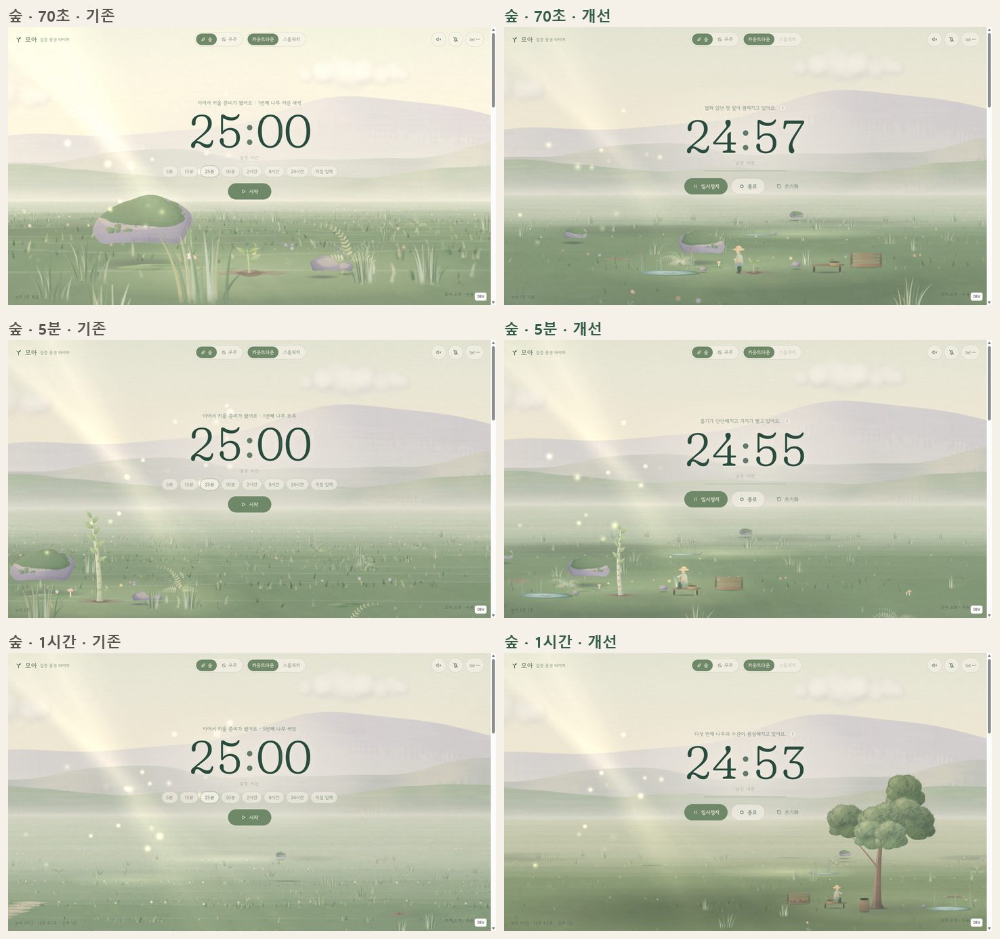

# 모아 — 집중한 시간이 자라는 풍경 타이머

> 집중한 시간이 모여 나만의 숲과 기지, 우주가 됩니다.

공부·독서·작업하는 동안 화면 아래에서 작은 존재들이 일하는 **정적 웹 타이머**입니다. 숲에서는 숲지기가 물·씨앗·낙엽으로 나무를 키우고, 외계 행성에서는 작업 드론이 자원을 캐서 개척지를 짓습니다.
그 결과는 군락·전초기지·구역으로 이어지는 풍경으로 남고, 실행 시간이 곧 세계의 시간이라 낮과 밤·계절·날씨·드문 사건도 함께 흐릅니다. 은하 테마에서는 빛 한 점에서 빅뱅이 퍼지고, 25분이면 첫 행성계가 생겨 별과 성운, 생명의 행성과 은하로 자랍니다. 서버·로그인·DB 없이 브라우저에서만 동작합니다.

- 테마: **숲**(파스텔 과슈풍 숲, 하루 24분·계절 72분, 날씨, 생명체, 연못·고목, 진행 단계 1~10) / **우주**(고리 행성이 뜬 외계 행성 개척지, 행성의 하루 32분, 자원 3종, 콜로니 단계 1~10, 정찰·전초기지, 주둔군·습격·수리·재건). 테마 이름은 "우주" 그대로이고 설정만 달 기지에서 외계 행성으로 바뀌었습니다. 습격은 세션 중 4~6분마다 오고(대부분 작은 교전, 세 번째마다 큰 습격, 5분 타이머에도 한 번), 수리는 별도의 정비 드론이 맡아 성장 속도에는 영향을 주지 않습니다.
- **은하**("처음의 우주"): 우주의 나이 A = 누적 시간 − 이 테마를 처음 고른 시점. 연대기 24분 20초(빅뱅 → 뜨거운 안개 → 첫 빛 → 우주 거미줄 → 첫 별 4분 → 첫 초신성 9분 30초 → 성운 → 집의 별 → 첫 행성 셋), 그 뒤 항성계 하나 9~16분(4곳 = 성단, 16곳 = 구역), 별먼지가 쌓일수록 행성이 많아짐, 생명의 행성(달 45분 → 혜성의 바다 1시간 10분~ → 생명 3시간 → 첫 불빛 8시간), 은하(원반 2시간 → 핵 각성 4시간 → 이웃 은하 6~100시간), 진행 단계 1~10, 우주 날씨, 세션 사건(4~6분마다), 드문 사건, 세션마다 남는 별자리, "새 우주 시작". 설계와 검수 기록: [`docs/COSMOS.md`](docs/COSMOS.md), 요구사항: [`docs/COSMOS_PROMPT.md`](docs/COSMOS_PROMPT.md)
- 모드: 카운트다운(최대·최소 제한 없음, 일·시·분·초 입력) / 스톱워치
- 작업 규칙: 실행 시간 → 자동 작업 → 자원 확보 → 운반·입고 → 자원 사용 → 성장·건설. 결정적 시뮬레이션(`src/sim/`, 튜닝 값은 `src/sim/config.ts`). 나무 한 그루 약 12.6분, 건물 하나 평균 약 7.8분(첫 건물 9.7분), 4개 = 군락/전초기지, 4곳 = 숲 구역/정착 구역
- 기술: React 19 · TypeScript 7 · Vite 8 · PixiJS 8 (모든 의존성 버전 고정)
- **살아있는 월드 보고서**: [`docs/LIVING_WORLD.md`](docs/LIVING_WORLD.md) — 구조 분석, 설계, Phase 2~10 검수 기록(화면·영상은 `docs/media/living/`)
- **지난 개선 보고서**: [`docs/IMPROVEMENT.md`](docs/IMPROVEMENT.md) — 확인한 문제, 개선 내용, 전후 비교(`docs/compare/`), 한 순환 영상(`docs/media/`), 이관 방법·결과, 검수와 한계



---

## 빠른 시작

```bash
npm install
```

```bash
npm run dev
```

브라우저에서 `http://localhost:5173` 을 엽니다. 개발 서버에서는 오른쪽 아래 **DEV** 검수 도구가 보입니다(운영 빌드에는 포함되지 않음).

```bash
npm test
```

```bash
npm run build
```

빌드 결과물은 `dist/` 입니다(타입 검사 → Vite 빌드). 로컬 확인:

```bash
npm run preview
```

> Windows에서 경로에 한글이 있으면 Vite의 파일 감시가 일부 변경을 놓쳐서, `vite.config.ts`에서 폴링 감시를 켜 두었습니다.

## GitHub Pages 배포 (개발 모드 빌드)

`main`에 푸시하면 `.github/workflows/pages.yml`이 테스트를 돌리고, **개발 모드로 빌드**해 `https://<계정>.github.io/<저장소>/`에 배포합니다. DEV 검수 도구, `?store=`, 시간 이동이 그대로 들어 있습니다.

1. 처음 한 번만: 저장소 Settings → Pages → Build and deployment → Source를 **GitHub Actions**로 바꿉니다.
2. `main`에 푸시하거나, Actions 탭에서 "Deploy to GitHub Pages (dev build)"를 직접 실행합니다.

로컬에서 같은 빌드를 확인하려면(Git Bash 기준, `MSYS_NO_PATHCONV=1`은 `/moatime/`가 윈도우 경로로 바뀌지 않게 막습니다):

```bash
MSYS_NO_PATHCONV=1 NODE_ENV=development BASE_PATH=/moatime/ npx vite build --outDir dist-pages
```

```bash
npx vite preview --outDir dist-pages --base /moatime/ --port 5181
```

운영용(DEV 도구 없음)으로 바꾸려면 워크플로에서 `NODE_ENV: development` 줄을 지우면 됩니다.

## Cloudflare Pages 배포

**Git 연동(권장)**

1. 저장소를 GitHub/GitLab에 올립니다.
2. Cloudflare 대시보드 → Workers & Pages → Create → Pages → 저장소 연결.
3. 빌드 설정
   - Framework preset: `None` (또는 Vite)
   - Build command: `npm run build`
   - Build output directory: `dist`
   - 환경 변수: `NODE_VERSION` = `22` 이상 (Vite 8 요구사항: Node 20.19+ / 22.12+)
4. 저장하면 배포됩니다. `public/_headers`가 해시된 에셋에 1년 캐시를 붙입니다.

**직접 업로드**: 로컬에서 `npm run build` 후 대시보드의 *Upload assets*에 `dist` 폴더를 올리거나 Wrangler를 사용합니다.

```bash
npx wrangler pages deploy dist --project-name moa-timer
```

배포 후 할 일
- 실제 도메인이 정해지면 `index.html`의 `og:image`를 절대 URL(`https://도메인/og/moa-og.jpg`)로 바꾸고 `<link rel="canonical">`을 추가하세요.

## 광고 연결

광고 슬롯은 풍경 아래 독립된 영역(`index.html`의 `.ad-slot`)이며 CSS로 높이를 미리 확보합니다. 광고가 늦게 오거나 실패·차단돼도 타이머와 풍경 위치는 변하지 않습니다. 자동 새로고침과 타이머를 가리는 광고는 없습니다.

`.env.example`을 참고해 빌드 환경 변수로 넣습니다(Cloudflare Pages → Settings → Environment variables).

```
VITE_ADSENSE_CLIENT=ca-pub-XXXXXXXXXXXXXXXX
VITE_ADSENSE_SLOT_BELOW=1234567890
VITE_ADSENSE_SLOT_FOOTER=1234567891
```

값이 없으면 "광고 영역 · 개발용 슬롯/준비 중" 자리표시가 보입니다. AdSense 스크립트는 앱이 상호작용 가능해진 뒤(`requestIdleCallback`) 비동기로 불러옵니다(`src/ads.ts`). 실제 게재 전에는 `public/ads.txt`를 추가하세요.

---

## 구조

```
src/
  core/            순수 로직 (렌더링 없음, 단위 테스트 대상)
    session.ts     T/E/W 상태 기계: start·pause·resume·finish·reset·newWorld
    engine.ts      저장·복원, Web Locks로 탭 간 직렬화, storage 이벤트 동기화, 완료 감지
    persist.ts     localStorage 검증·백업·저장 실패 처리
    rules.ts       세계 구조(4개/군락, 4곳/구역)와 이관용 옛 성장 규칙(v1)
    world.ts       2.5D 세계 배치: 구역·군락·슬롯·길(구역 사이 연속)
    duration.ts    입력 검증(표현 범위·오버플로)과 표시 형식
    describe.ts    상태 문구·세션 요약·하단 통계(시뮬레이션에서 생성)
  sim/             작업·자원 시뮬레이션 (렌더링 없음, 단위 테스트 대상)
    config.ts      비용·생산량·소요 시간·작업자 상한·주둔군·습격·월드 시간 척도
    space.ts       채굴·운반·예약·단계 조립·전력·정찰·연결 공사·주둔군·습격 처리·수리·재건
    cosmos.ts      은하: 연대기·항성계 일정(닫힌 형태), 가스·별먼지·얼음·물 장부, 단계, 생명의 행성·은하 상태
    cosmosDescribe.ts 은하의 상태 문구·자세히·요약
    raid.ts        습격 계획(세력·규모·피해·잔해), 시드로 결정
    forest.ts      물·씨앗·낙엽·퇴비·부엽토, 돌봄 지점, 다람쥐·빗물받이·물길·꽃밭
    runner.ts      W까지 사건 단위 계산, 체크포인트·되감기
    layout.ts      작업 장소(노드)와 이동 시간(항상 가로 배치 기준)
    spacePlan.ts   건물 배정(이관된 시설은 옛 종류를 새 건물에 대응)
    describe.ts    작업 문구와 상세 수치
  world/           월드 시간 계층 (W와 시드의 순수 함수, 단위 테스트 대상)
    clock.ts       낮과 밤(숲 24분, 행성 32분), 해·달·별
    season.ts      계절(72분)·1년(4.8시간)과 경계 보간
    weather.ts     숲의 날씨 상태 머신(맑음·흐림·약한 비·큰비·폭풍·안개·눈)
    timeline.ts    30분 블록마다 사건 하나, 우선순위와 자격 조건
    pace.ts        세션 길이에 맞춘 습격 일정과 조용한 세션의 행성 사건
    events.ts      드문 사건 목록(사슴·무지개·첫눈·개화 / 모래 폭풍·전기 폭풍·플레어·오로라·혜성·함대 등)
    cosmos.ts      은하: 우주 날씨, 드문 사건(우주의 나이 블록), 세션 사건 일정, 헤드라인, 배경 별, 세션 별자리
    env.ts         위 값을 W에서 한 번에 계산
  scene/           PixiJS 장면
    host.ts        Pixi 앱·렌더 루프·카메라 리그·가시성/모션 처리
    diorama.ts     원근 카메라 + 카드(빌보드) 정렬·컬링
    camera.ts      작업 구역 → 프레이밍(화면 영역 맞춤) → 2단 저역통과 추종
    occlusion.ts   작업·타이머 앞을 가리는 나무·시설을 흐리게
    systems.ts     지면 띠·안개·하늘/원경·빛/종이 오버레이
    paint/         과슈 붓 질감·풍경 페인터(두 테마 공통)
    forest/        숲지기·다람쥐, 공터(샘·바구니·퇴비·빗물받이·물길·꽃밭), 계절 나무, 구역
    director.ts    사건 연출 채널(fx·ambient) 동시 상한과 입자 예산
    gfx.ts         매 프레임 다시 그리는 Graphics를 작은 render group으로 분리
    forest/systems 하늘·지형·식생·생명체·날씨·빛
    space/         작업 드론·정비 드론(drone.ts), 건물 그림(paintColony.ts), 전초기지(상자 더미·광맥·에너지 분출구), 건물 단계·피해, 구역·행성 네트워크
    space/systems  하늘(가스 행성)·지형·콜로니·작업자·확장·방어·행성 사건
    cosmos/        은하: 화면 공간 고정 구도(층별 시차), 자체 카메라, 수채·과슈 텍스처, 빅뱅 안개·먼 하늘·은하·성운·항성계·집의 항성계(생명의 행성)·하늘 사건
  app/             React UI (상단 바, 타이머, 요약, 설정, 자세히, DEV 패널), 시뮬레이션 러너(sim.ts)
  audio/sound.ts   WebAudio 합성 환경음·알림음
  ads.ts           광고 슬롯 로더
index.html         SEO용 정적 콘텐츠(소개·사용 방법·FAQ·광고 슬롯)
docs/DESIGN.md     구도·팔레트·에셋 분리·성장 타임라인·카메라 문법 설계
docs/ASSETS.md     에셋 출처·라이선스
```

React는 UI와 세션 상태만 다루고, 프레임마다 바뀌는 위치·회전은 PixiJS 객체에 직접 씁니다. 장면은 매 프레임 엔진에서 W를 읽고, 그 W의 **시뮬레이션 상태**(작업자 단계·재고)를 그대로 그립니다. 렌더링을 멈춰도 시뮬레이션 결과는 W에서 다시 계산됩니다.

## 시간과 성장 규칙

| 기호 | 뜻 | 저장 위치 |
|---|---|---|
| T | 이번 카운트다운 설정 시간 | `session.targetMs` |
| E | 이번 세션 실행 시간(일시정지 제외, T 초과 적립 없음) | `accruedMs` + (지금 − `segmentStartedAt`) |
| W | 세계 누적 시간 = `world.bankedMs` + 열린 세션의 E | 계산값 |

- 작업과 성장은 오직 W로 계산합니다. 설정 시간·모드·세션 분할·화면 표시 여부·효과 강도는 결과에 영향을 주지 않습니다(5분×3 = 15분×1).
- 숲과 우주는 같은 W에서 각자의 작업과 자원을 따로 가지며 서로 교환·차감하지 않습니다. 테마를 전환하면 그 테마를 현재 W까지 한 번만 계산합니다.
- 은하는 W 대신 우주의 나이 A = W − 원점을 씁니다. 원점은 이 세계에서 은하를 처음 고른 순간의 W로 한 번 저장되고(`world.cosmos.origin`), "새 우주 시작"이 이 원점만 지금으로 옮깁니다. 은하의 혜성·오로라 같은 세션 사건과 별자리는 세션 기록에서 나오며 성장에는 영향을 주지 않습니다.
- E는 타임스탬프에서 매번 계산하므로 새로고침·중복 이벤트·여러 탭에서도 같은 구간이 두 번 쌓이지 않습니다. 세션 종료 시 E를 `bankedMs`에 한 번만 더하고 `banked` 플래그를 같은 쓰기에 기록합니다.
- 변경은 Web Locks 안에서 저장소를 다시 읽은 뒤 순수 전이를 적용합니다(지원하지 않는 브라우저는 동기 실행).
- 카운트다운 종료 후 늦게 돌아와도 정확히 T까지만 적립하고, 늦게 알아챈 완료는 빛 연출·알림음을 재생하지 않습니다.
- 초장기 타이머를 하나의 `setTimeout`에 맡기지 않습니다. 250ms 주기 확인은 화면 갱신용이고, 종료는 종료 시각과 현재 시각으로 판정합니다.
- 시스템 시계가 뒤로 가면 E가 줄지 않도록 세그먼트를 다시 시작합니다.
- 입력은 0 이상 정수만, 합계 > 0, `Date`가 표현 가능한 범위(약 2만 7천 년)를 넘지 않게 검증합니다.

### 작업 흐름(요약)

| 숲 | 우주 |
|---|---|
| 씨앗 꺼내기 → 샘에서 물 긷기 → 흙 고르기 → 심기·물 주기(35초) | 광맥으로 이동 → 채굴 → 적재 → 운반 → 하역(첫 상자 28초) |
| 발아·떡잎 → 돌봄 지점 3곳에서 물(두 번째에 부엽토 멀칭) | 비용이 모이면 예약 → 상자를 현장으로 |
| 성숙(약 12.6분) → 씨앗·낙엽이 일정 규칙으로 떨어짐 | 측량 → 기초 → 바닥 → 골조 → 외벽 → 부품 → 전력·점등 → 점검(첫 건물 약 9.7분) |
| 씨앗 줍기·낙엽 긁기 → 퇴비 → 8분 뒤 부엽토 → 다음 공터·꽃밭 | 발전기 = 전력, 사령부·공장 = 드론 추가, 연구 = 희귀 광맥·정찰 드론, 병영·공장 = 보병·탱크, 세션마다 습격 → 방어 드론·주둔군이 막고 정비 드론이 수리·재건 |
| 구역이 넓어지면 연못 파기·고목 심기, 진행 단계 1~10 | 정찰 → 새 전초기지 → 전력선 연결, 콜로니 단계 1~10 |

자세한 규칙·수치는 `docs/LIVING_WORLD.md`(이번 개선)와 `docs/IMPROVEMENT.md`(지난 개선), 구도·팔레트는 `docs/DESIGN.md`.

## 개발용 검수 도구 (DEV 전용)

`npm run dev`에서만 보입니다.

- 재고·작업자별 현재 단계(무엇을 어디서 어디로, 남은 시간)·계절·구역/군락·시뮬레이션 사건 수·계산 시간·체크포인트(메모리/저장)
- 시간 이동 `+10초`~`+100시간`, `다음 완성 −20초`, `다음 계절 −1분`, `W=0`, 시간 직접 입력
- 빠른 재생 ×10·×60·×300(실행 중에 세계 시간에만 더함), 체크포인트 저장, 세션 임의 종료
- FPS·프레임 CPU 시간·카드 수·텍스처 수·현재 프레이밍
- URL 파라미터: `?store=이름`은 별도 저장 공간(실제 세계를 건드리지 않고 시험), `?nogl`은 렌더러 실패 대체 화면 확인

---

## 검수 결과 (실제로 확인한 것)

확인 환경: Windows 11, Node 24.14, Playwright 헤드리스 Chromium(ANGLE · NVIDIA GeForce GTX 1060 6GB · Direct3D11, 144Hz), 개발 서버 빌드.

> 이번 개선(작업·자원 시뮬레이션, 계절, 구도, 이관)의 검수는 [`docs/IMPROVEMENT.md` 7~8절](docs/IMPROVEMENT.md)에 정리했습니다: 자동 테스트 73개, 실제 속도 76초 × 2테마, 두 탭 실시간 1분, 브라우저 이관, 운영 빌드 콘솔 0건, 성능(2,000시간까지 140fps대, 카드 약 2,100~2,500개).
>
> 아래는 처음 구현 때의 타이머·저장 검수 기록입니다. 시간 계산·저장·탭 동기화 테스트는 지금도 같은 테스트로 통과합니다. 옛 성장 연출·사건 관련 항목은 새 시뮬레이션으로 대체되었습니다.

**자동 테스트 — 처음 구현 때 48개 통과**
- 5분×3회와 15분×1회의 W·성장 상태가 같음
- 25분 타이머·2시간 타이머·스톱워치로 10분 실행 시 성장량이 같음
- 1분·5분·25분·2시간·8시간·24시간·30일 카운트다운이 정확히 T를 적립하고, 종료 후 3일 늦게 돌아와도 T까지만 적립
- 스톱워치도 같은 규칙, 단위 중간 종료 후 다음 세션에서 이어짐
- 일시정지 시간 제외, 중복 시작·일시정지·재개·종료·초기화 요청에서 이중 적립 없음
- 테마 변경이 시간을 적립하지 않음, 새로고침 중 실행 구간 정확히 1회 복원
- 두 탭이 같은 세계에서 시작·일시정지·재개·완료해도 1회만 적립
- 페이지를 닫은 동안 끝난 카운트다운은 조용히 기록, 1분 늦게 알아챈 완료는 live=false(연출·소리 없음)
- 시스템 시계가 2시간 뒤로 가도 E가 줄지 않음 · 일시정지 중 시계가 뒤로 가도 재개 후 시간이 더해지지 않음 · 두 탭이 같은 시계 역행을 동시에 감지해도 1회만 보정
- 다른 탭의 중복 시작은 아무것도 바꾸지 않음, 표현 범위를 넘는 목표로 시작하면 직전 세션 기록이 그대로 남음
- 저장 실패 시 메모리로 계속 동작, 손상된 저장소는 백업에서 세계 복원
- 입력: 1초·90분·24시간·30일·전각 숫자 허용 / 0·소수·음수·문자·자릿수 초과·Date 범위 초과 거부
- 사건: 같은 종류 연속 없음, 사건 사이 90초 이상, 군락·구역 공개 구간 회피(4개 시드 × 200단위)
- 세계: 구역 사이 길 끝점 연속, 슬롯 간격, 새 구역이 앞쪽(이전 구역은 뒤에 남음), 인접 구역 성격 비반복(3000구역), 전초기지마다 전력 모듈 시작·종류 비반복

**브라우저에서 확인**
- 숲: 0초 씨앗·흙·이끼 바위 구도 → 30초 갈고리 새싹 → 70초 떡잎 → 2.5분 본잎 묘목 → 6.5분 잎 달린 어린 나무와 첫 잎 묶음 → 14분 성숙한 나무, 1시간 군락 공개, 4시간 구역 공개(길·샘), 4시간 40초 새 구역 근접(이전 숲이 후경에), 50시간·400시간 원경
- 우주: 측량선·패드·골조·외벽·태양광 날개 개방·통로, 1시간 전초기지, 4시간 정착 구역(착륙장·도로 표지등), 새 구역 근접(이전 기지가 후경에)
- 실시간 4초 카운트다운: 진행 표시 → 완료 → 요약 카드("+4초", 누적, 단계 변화) → 빛 연출
- 정원사 물 주기 사건이 실제 실행 중 재생됨(스톱워치)
- 실제 두 탭: 탭 A 시작 → 탭 B 일시정지 → 탭 A 재개 → 완료, 두 탭 모두 정확히 8,000ms 적립, 알림음 담당 탭 1개 선출
- `?nogl`: 정지 포스터 + 안내 문구, 타이머·적립 정상
- 모션 줄이기: 현재 구역 정적 전체 보기, 흔들림·입자·자동 카메라 이동 없음
- 모바일 세로(390×844): 2줄 상단 바, 타이머 상단·풍경 하단 배치, 성장 대상과 조작부가 잘리지 않음
- 운영 빌드(`vite preview`)에서 두 테마 모두 콘솔 오류 0건, DEV 패널·개발 훅 미포함(테마 장면은 지연 로드 청크: 숲 59KB, 우주 40KB)
- 테마 빠른 전환(숲 → 우주 → 숲) 후 설정·장면·페이지 테마가 일치, 시작/일시정지/재개 전환 중 키보드 포커스 유지, FAQ 위 스페이스 키가 타이머를 건드리지 않음, 24시간 프리셋 뒤 직접 입력에 '1일'이 보임

**독립 코드 리뷰 반영** — 별도 리뷰 에이전트의 지적을 확인해 고쳤습니다.
- 시계 역행 보정이 실행되지 않은 시간을 더할 수 있던 문제(일시정지 중 역행, 두 탭 동시 감지) → 마지막으로 관찰한 경과 시간 기준의 멱등 보정
- 예약된 완료 알림음이 상태 변경 이벤트에 끊기고 다시 울리던 문제 → 일시정지·초기화·사용자 종료일 때만 취소
- 클릭한 적 없는 숨은 탭이 소리를 맡아 알림음이 안 울릴 수 있던 문제 → 마지막으로 상호작용한(오디오가 열린) 탭이 환경음·알림음을 담당
- 테마 전환 경합·로드 실패 시 포스터 고착·초기화 중 테마 변경 유실·작성 중 세계 변경 → 빌드 직렬화, 실패 시 이전 테마 유지와 텍스처 해제, 마지막 요청 우선
- WebGL 컨텍스트 손실 시 영구 '그릴 수 없음' 표시 → 복구 이벤트를 기다렸다가 다시 표시(6초 안에 복구되지 않을 때만 대체 화면)
- 모션 줄이기에서 방문 사건이 1초 간격으로 끊겨 재생되던 문제 → 모션 줄이기에서는 사건 없음(일시정지는 사건을 멈출 뿐 지우지 않음)
- 저장 실패 경고가 복구 후에도 남던 문제, 접근성(라디오 그룹 화살표 키, 메뉴 포커스, 페이지 제목 h1)

**운영 빌드에서만 나던 문제 수정** — Vite 운영 빌드의 트리 셰이킹이 PixiJS 렌더 파이프 등록을 떨어뜨려 매 프레임 `validateRenderable` 오류가 나던 것을, 사용하는 확장(`pixi.js/app`, `graphics`, `mesh`, `sprite-tiling`)을 명시적으로 불러와 해결했습니다(`src/scene/host.ts`).

**성능 측정** (1440×820, DPR 1, 위 GPU, 개발 빌드)

| 상태 | 숲 FPS / 프레임 CPU | 우주 FPS / 프레임 CPU | 카드 수 |
|---|---|---|---|
| 첫 단위(30초) | 144 / 1.6ms | 144 / 1.9ms | 812 / 862 |
| 4시간 구역 공개 | 136 / 3.9ms | 142 / 3.3ms | 874 / 891 |
| 50시간 | 144 / 5.8ms | 137 / 6.6ms | 1,344 / 1,347 |
| 2,000시간 | 144 / 3.5ms | 144 / 4.6ms | 1,344 / 1,347 |

긴 누적에서도 상세 구역은 최대 3개(이전·현재·다음), 원경 LOD 4개로 고정되어 카드 수가 약 1,350개에서 멈춥니다. 텍스처는 숲 125개·우주 55개를 테마 전환 시 해제합니다.

## 검증하지 못한 항목과 남은 한계

작업 시뮬레이션·계절·구도·이관에 관한 미검증 항목과 한계는 [`docs/IMPROVEMENT.md` 8절](docs/IMPROVEMENT.md)에 있습니다(실기기, 수 시간 실시간 실행, 1,500시간 이상 한 번에 점프할 때 약 1초 정지, 배포 직후 열려 있던 옛 버전 탭 등). 아래는 공통 항목입니다.

- **실기기**: iOS Safari, 안드로이드 Chrome, 저사양 내장 GPU, 고DPI(2x) 노트북에서 직접 측정하지 못했습니다. 모바일은 헤드리스 Chromium의 390×844 화면으로만 확인했습니다. 저사양 기기는 설정의 *저전력 모드*(30fps·해상도 1x·잎 묶음 변주 축소)를 권장합니다.
- **장시간 실시간 실행**: 8시간·24시간을 실제로 흘려 보지는 않았고, 계산은 단위 테스트(가짜 시계)와 개발 도구의 시간 이동으로 확인했습니다.
- **소리**: WebAudio 합성 코드는 동작하지만 청감 품질은 사람이 들어 확인하지 않았습니다. 백그라운드 탭의 정시 알림음은 오디오 클럭 예약으로 *시도*할 뿐 보장하지 않습니다(UI에서도 보장한다고 표시하지 않음). 소리는 마지막으로 클릭한 탭 하나에서만 납니다.
- **스크린리더**: `aria-live`로 상태 변화만 알리도록 구현했으나 실제 VoiceOver/NVDA로 들어 보지 않았습니다.
- **광고**: 실제 AdSense 계정·슬롯으로 게재를 확인하지 않았습니다(개발용 슬롯만 확인).
- **아트워크**: 모든 그림은 절차적 과슈 페인팅입니다. 손그림 원화 수준의 붓 터치 밀도가 필요하면 `docs/ASSETS.md`의 교체 지점을 참고해 분리 에셋을 받아 교체할 수 있습니다.
- **한글 글꼴**: Gowun Dodum 한글 서브셋(woff2 약 406KB)을 `font-display: swap`으로 불러옵니다. 첫 방문에서 잠시 시스템 글꼴로 보일 수 있습니다.
- **여러 탭의 지연**: Web Locks가 없는 오래된 브라우저에서는 두 탭이 같은 순간 버튼을 누를 때 극히 짧은 경합 창이 남습니다(시간은 타임스탬프 기반이라 적립이 두 배가 되지는 않지만, 마지막 쓰기가 이깁니다).
- **스톱워치**: 실제 스톱워치처럼 브라우저를 닫아 둔 동안에도 계속 흐릅니다. 오래 켜 두었다면 종료 시 그 시간이 함께 쌓입니다.

## 라이선스

에셋·글꼴·의존성 라이선스는 `docs/ASSETS.md`를 참고하세요.
