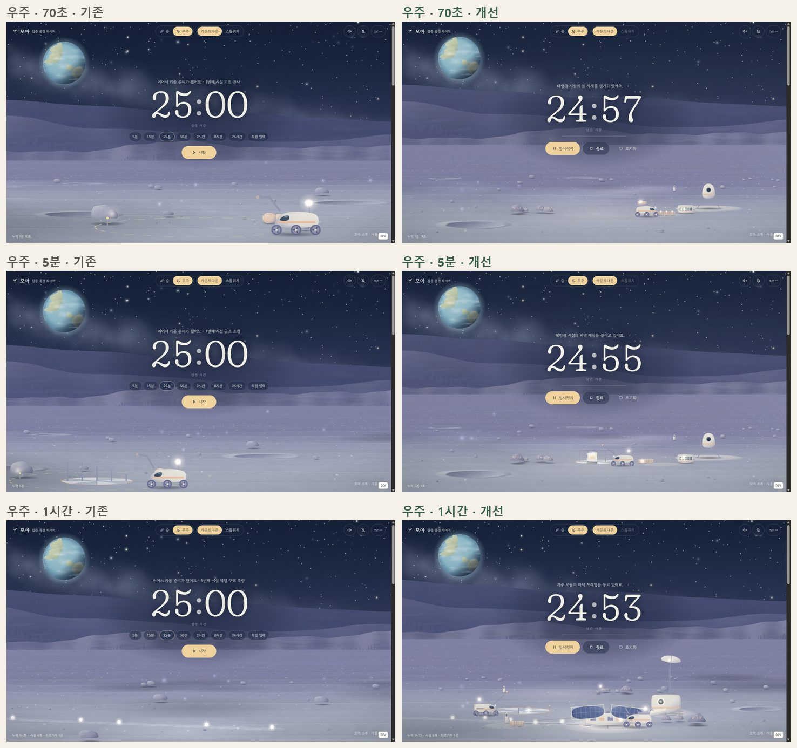
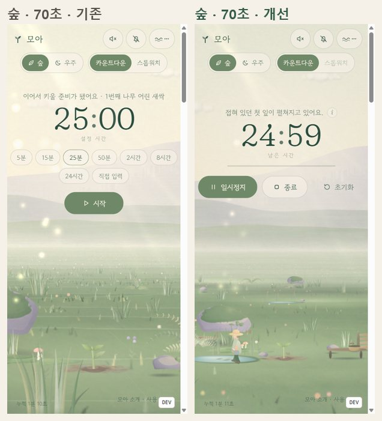
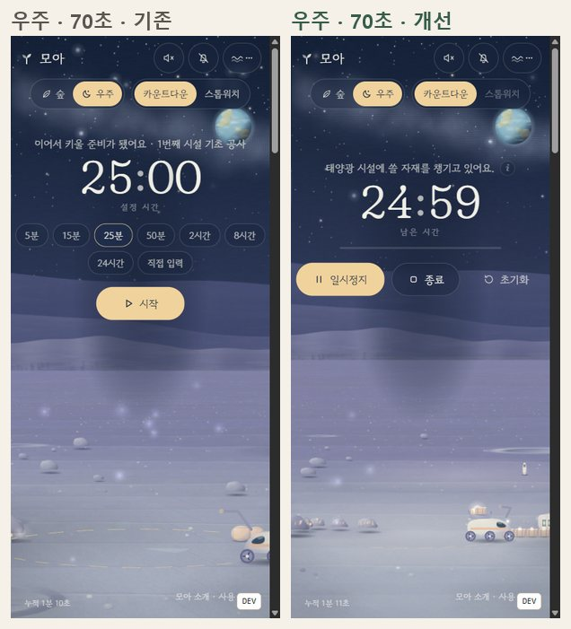

# 모아 개선 보고서 — 일하는 숲과 기지 (데이터 버전 2)

> “내가 집중하는 동안 작은 존재들이 자원을 모으고, 운반하고, 사용하며, 그 결과가 살아 있는 풍경으로 남는다.”

기존의 “15분마다 대상 하나 생성” 규칙을 **실행 시간 → 자동 작업 → 자원 확보 → 운반·입고 → 자원 사용 → 성장·건설**로 바꿨습니다.
화면에 보이는 상자·씨앗·낙엽·부엽토·물은 모두 시뮬레이션의 실제 재고이고, 시설과 나무는 그 자원을 써서만 완성됩니다(별도 타이머가 대상을 만들지 않음).

---

## 1. 실제로 확인한 문제 (개선 전 화면에서)

개선 전 빌드를 헤드리스 Chromium(1440×820, 390×844)에서 0초·30초·70초·5분·1시간·4시간으로 캡처해 확인했습니다(`docs/compare/*-기존` 쪽).

| 문제 | 확인한 장면 |
|---|---|
| 새싹이 작고 앞쪽 큰 이끼 바위·풀에 시선을 빼앗김 | 숲 70초: 새싹 약 60px, 모바일 약 30px |
| 공사 현장이 화면 가장자리에 잘림 | 우주 5분: 패드·골조가 왼쪽 아래 모서리, 로버만 크게 보임 |
| 다음 단위로 넘어가면 자란 대상이 화면 밖으로 사라짐 | 숲 1시간: 나무 4그루는 화면 밖, 빈 씨앗 자리만 보임 · 우주 1시간: 거의 빈 화면 |
| 새 구역의 씨앗이 근경 바위 뒤에 묻힘 | 숲 4시간 |
| 변화의 이유와 준비 과정이 없음 | 두 테마 모두 시간이 지나면 대상이 저절로 자람(자원·운반·작업 없음) |
| 초원에 일정 간격의 얇은 밝은 줄(줄무늬) | 모든 숲 화면. 원인: 근경/원경 팔레트 지면 띠를 섞을 때 원경 띠를 불투명하게 깔아, 위쪽 부드러운 가장자리가 두 번 겹쳐 밝게 보임 |

개선 중 추가로 발견해 고친 것: 뒤쪽 군락·전초기지에서 일할 때 앞쪽에 다 자란 나무·시설이 작업과 타이머를 가림, 겨울 눈이 봄 시작에 다시 나타남, 눈이 사라진 수관 자리에 떠 있음, 상자가 둥근 덩어리처럼 보임, 첫 방문 순간(W=0)에 숲지기가 보이지 않음, 상세 보기 버튼이 문구 길이에 따라 움직여 클릭이 빗나감.

## 2. 적용한 개선

### 2.1 작업·자원 시뮬레이션 (`src/sim/`)

- **결정적 사건 시뮬레이션.** 상태는 (세계 시드, 시작 기준점, `SIM_VERSION`, 누적 실행 시간 W)의 순수 함수입니다. 작업자는 “단계(step)” 목록을 수행하고, 각 단계는 시작·끝 시각(W 기준 정수 ms)을 가집니다. 재고 변화는 단계가 끝나는 사건에서만 고정된 순서로 일어납니다. 화면은 현재 단계를 W로 보간해 그립니다.
- **분할 무관.** 같은 W까지 한 번에 가든 프레임마다 가든 5분씩 세 번 가든 결과가 같습니다(테스트로 확인). 세션 길이·모드·화면 표시 여부·효과 강도·저전력 모드는 결과에 들어가지 않습니다.
- **예약 방식 하나로 통일(우주).** 채굴한 광물은 하역 전까지 적재물이고, 저장소에 내려놓아야 재고가 됩니다. 공사를 시작할 때 비용 전체를 한 번 예약(`reservedAt`)하고, 예약된 상자는 저장소 → 로버 → 현장 더미 순으로 옮겨진 뒤 단계마다 소비됩니다. 매 사건에서 `채굴량 = 완성 비용 + 진행 중 예약 + 자유 재고`가 성립합니다(테스트).
- **숲의 순환.** 씨앗은 바구니 ⇄ 숲지기 손 → 심기, 낙엽은 성숙한 나무 아래의 *수집 가능한 더미*(장식용 지면 낙엽층과 별개) → 바구니 → 퇴비 묶음 → 8분 뒤 부엽토(낙엽 2장 = 1줌) → 다음 공터·멀칭·꽃밭. 수집한 낙엽은 다시 수집되지 않습니다(테스트).
- **막힘 없음.** 첫 나무는 시작 씨앗 3알과 기본 흙으로, 첫 시설은 착륙선 배터리로 지어집니다. 배터리가 바닥나도 착륙선의 느린 충전으로 언제나 다시 채워지고, 성숙한 나무는 계절과 무관하게 일정 규칙으로 씨앗을 떨어뜨립니다. 저장소 용량(16)은 가장 비싼 시설(10)보다 크고, 채굴은 필요량만큼만 합니다. 120시간 실행에서 두 테마 모두 1시간 이상 완성이 멈춘 적이 없습니다(테스트).
- **장기 복귀.** 지나간 시간은 사건 단위로 한 번만 계산하고 애니메이션은 재생하지 않습니다. 메모리 체크포인트(20분 간격, 최대 72개)와 브라우저에 저장하는 체크포인트(테마별 1개, 5초마다·숨김·일시정지 때)로 새로고침 후 짧게 이어 계산합니다. 체크포인트는 캐시일 뿐이라 지워도 결과는 같습니다.

### 2.2 우주 — 자동 개척기지

시작: 착륙선, 채굴 로버 1대, 가까운 광물 지대, 저장 패드, 기지 배터리.

1. 로버가 광물 지대로 가서 드릴로 캐고(먼지), 광물 조각이 적재함으로 옮겨집니다(빈/가득 찬 적재함이 보임).
2. 저장소로 돌아와 하역하면 상자가 하나씩 더미에 놓입니다. 예약된 상자에는 작은 표시등이 붙습니다.
3. 비용만큼 모이면 다음 공사 자리(측량선·말뚝)가 드러나고, 로버가 상자를 현장으로 옮깁니다.
4. 기초 → 바닥 프레임 → 골조 → 외벽 → 기능 부품(태양광 날개, 안테나 마스트와 접시, 통로 입구…) → 전력 연결·창 점등 → 로버 점검. 각 단계의 상자는 조립되면서 현장 더미에서 사라집니다. 용접 불꽃은 구조물의 실제 작업 지점에 나타납니다.
5. 다음 작업으로 이동합니다.

시설의 역할: 태양광(기지 배터리 충전량 증가, 케이블), 로버 작업장(보조 로버, 최대 3대), 거주 모듈(조립 4% 단축·최대 2개, 문 옆 생활 흔적), 온실(7분마다 로버의 돌봄 방문), 탐사 안테나(같은 정착 구역과 다음 구역 첫 광물 지대를 미리 발견 — 탐사 생략, 표지등), 연결 거점(구역의 마지막 시설, 다음 정착 구역으로 길). 탐사 안테나가 없는 새 전초기지는 로버가 먼저 광물 지대를 탐사합니다.

배경: 지구(가로 화면 왼쪽 위·세로 화면 오른쪽 위), 별 밝기 변화와 일부만 은은한 반짝임(타이머 주변 제외), 지구 구름의 매우 느린 이동, 별똥별(주변 시계로 45~120초 간격, 1.1~1.8초, 큰 공사·카메라 이동 중에는 미룸).

### 2.3 숲 — 숲지기의 생태 순환

시작: 숲지기, 샘, 물뿌리개, 씨앗 바구니(3알), 작은 공터.

1. 바구니에서 씨앗을 꺼내 샘에서 물을 긷고, 공터의 흙을 고르고(밝은 흙 색면), 씨앗을 심고 물을 줍니다(첫 35초).
2. 흙이 움직이며 새싹이 오르고 떡잎이 펼쳐집니다. 성장은 돌봄 지점(성장 6%·30%·62%)에서 멈춰 물을 기다리고, 숲지기가 미리 오면 멈추지 않습니다. 두 번째 돌봄 때 부엽토가 있으면 멀칭(성장 12% 단축).
3. 성숙한 나무는 5분마다 씨앗을, 4분(계절 배율: 봄 0.6·여름 1·가을 2.2·겨울 0.4)마다 수집 가능한 낙엽을 떨어뜨립니다.
4. 숲지기는 바구니가 줄면 씨앗을 줍고, 퇴비가 부족하면 낙엽을 긁어 퇴비 더미로 옮깁니다. 나머지 낙엽은 풍경에 남습니다.
5. 부엽토로 다음 공터를 미리 가꾸고(“모은 낙엽으로 다음 공터를 가꾸고 있어요.”), 남는 부엽토와 씨앗으로 꽃밭을 만듭니다.

이후 역할: 다람쥐(나무 4그루 뒤, 떨어진 씨앗을 다음 심을 자리에 묻음 — 숲지기가 그 자리에 심음), 벌·나비(꽃밭 주변, 꽃밭이 있는 군락의 씨앗 간격 25% 단축), 빗물받이(두 번째 공터부터, 3분마다 1회분씩 차고 숲지기가 사용), 작은 물길(공터에 나무 2그루 뒤, 샘물을 뒤쪽 웅덩이로), 퇴비 공간. 비·동물이 없어도 기본 성장은 샘과 나무 씨앗만으로 계속됩니다.

계절(`SEASON`): 누적 실행 120분에 한 바퀴, 계절마다 30분, 경계 전후 5분 보간. 일시정지·대기 중에는 멈춥니다. 가을에는 잎 묶음마다 다른 때에 금빛·살구빛으로 바뀌고, 늦가을에 활엽수가 성기게 되며, 겨울에는 마른 잎 몇 장과 가지 끝·상록수의 얇은 눈, 땅의 얇은 눈 조각(작업 자리·길 제외), 묘목은 짚으로 감쌉니다. 봄에 새잎이 다시 납니다. 묘목과 자라는 나무는 계절로 잎을 잃지 않고, 성장과 필수 자원 공급은 계절과 무관합니다.

### 2.4 화면 구도와 카메라 (`src/scene/camera.ts`, 각 테마의 `framing`)

- **가까운 작업 구도.** 처음에는 작업 경로 전체(숲: 샘·새싹·바구니 의자, 우주: 광물 지대·현장·저장소)를 화면 너비 약 44~46% 영역(가로), 거의 전체 폭(세로)에 맞춥니다. 작업 자리는 타이머 아래 띠 또는 측면입니다.
- **안정된 범위.** 프레이밍 상자는 고정된 장소와 단계별 크기(새싹 60 → 묘목 170 → 나무 300 wu)로 정해지고, 움직이는 작업자나 대상의 순간 크기로 정하지 않습니다. 최대 줌 상한을 둡니다.
- **핵심 순간 고정.** 발아·첫 잎(성장 0.6~8%), 심기·물 주기, 부품 설치·점등 중에는 카메라 목표를 바꾸지 않습니다.
- **넓히기와 이동.** 군락이 채워지면 측면 영역으로 천천히 넓히고, 군락·전초기지가 완성되면 26초 동안 전체를 보여 준 뒤 다음 작업 구역으로 갑니다. 뒤쪽 군락은 약간 높은 시점에서 봅니다.
- **가림 처리.** 작업 구역보다 앞에 서서 그 위를 덮는 나무·시설은 서서히 22%까지 흐려지고, 카메라 가까이에서 타이머를 덮으면 5~14%까지 흐려집니다. 대상을 앞으로 끌어내지 않아 원근이 유지됩니다(`src/scene/occlusion.ts`).
- **강조.** 숲은 공터마다 햇빛 웅덩이와 밝은 흙, 우주는 전초기지 작업등 빛 웅덩이와 접지 그림자. 안개는 현재 대상보다 뒤에만 깔려 배경 대비를 낮춥니다. 점멸·네온 외곽선은 쓰지 않습니다.
- **지면 줄무늬 제거.** 근경/원경 띠를 서로 보완하는 투명도로 섞습니다(`src/scene/systems.ts`).

### 2.5 상태 안내·상세 보기·설정

- 타이머 위 한 줄 문구는 실제 단계에서 생성합니다(`src/sim/describe.ts`). 예: “광물을 저장소로 운반하고 있어요.”, “태양광 패널을 펼치고 있어요.”, “첫 나무에 물을 주고 있어요.”, “모은 낙엽으로 만든 부엽토로 다음 공터를 가꾸고 있어요.” 문장이 바뀔 때만 다시 그립니다.
- 자원은 세계 안에서 먼저 보입니다(상자 더미·예약 표시등, 바구니의 씨앗, 빗물받이 수위, 퇴비 더미와 부엽토 더미, 기지 배터리 칸). 정확한 수치는 왼쪽 아래 **자세히**에서만 봅니다.
- 설정: 애니메이션(시스템/켜기/끄기 — 끄면 현재 상태를 정지 화면으로), 효과 강도(낮음/기본/풍부함 — 반짝임·입자·방문자·낙엽 빈도만), 자동 카메라(끄면 지금 시점 유지), 저전력. 일시정지하면 작업·성장·장면 움직임이 함께 멈춥니다.
- 효과 종류: 환경(바람·안개·빛·구름·별), 현재 작업(드릴 먼지·용접 불꽃·물방울·상자 이동), 주변 사건(새·나비·벌·별똥별·떨어지는 잎), 카메라 이동. 주변 사건은 카메라 이동 중 미루고, 핵심 작업 중에는 배경 빛과 반짝임을 낮춥니다.

## 3. 수정한 주요 파일과 설정 위치

| 파일 | 내용 |
|---|---|
| `src/sim/config.ts` | **모든 튜닝 값**: 이동 속도, 작업 시간, 비용, 단계별 자재, 배터리·충전, 작업자 수 상한, 생산 주기, 퇴비 시간, 계절 주기, 효과 빈도, `SIM_VERSION` |
| `src/sim/space.ts`, `forest.ts` | 두 테마의 작업 분배(우선순위·대기열), 단계 효과, 사건 루프, 화면용 질의 |
| `src/sim/runner.ts` | W까지 계산, 체크포인트, 되감기 |
| `src/sim/layout.ts`, `spacePlan.ts`, `season.ts`, `describe.ts` | 작업 장소, 시설 배정(기존 시설 종류 유지), 계절, 상태 문구 |
| `src/core/persist.ts`, `session.ts`, `rules.ts` | 데이터 버전 2, 이관, 시뮬레이션 기준점(`world.base`) |
| `src/app/sim.ts` | 테마별 러너, 체크포인트 저장 |
| `src/scene/space/*` | 로버(적재·도구·자세), 전초기지(상자 더미·광물 지대·배터리·궤도 자국·케이블), 시설 단계, 장면 |
| `src/scene/forest/*` | 숲지기·다람쥐, 공터(샘·바구니 의자·퇴비·빗물받이·물길·꽃밭), 계절 수관·눈, 장면 |
| `src/scene/camera.ts`, `occlusion.ts`, `strip.ts`, `systems.ts`, `host.ts` | 작업 구역 프레이밍·고정, 가림 처리, 지면 띠, 프레임 정보 |
| `src/app/components/*` | 상태 문구, 자세히, 설정 메뉴, 요약(이번 세션에 모은 자원), DEV 패널 |

## 4. 개선 전후 비교

같은 누적 시간, 같은 화면 크기에서 실제 렌더러로 찍었습니다(`docs/compare/`).

| | |
|---|---|
| 숲 70초·5분·1시간 |  |
| 우주 70초·5분·1시간 |  |
| 모바일 70초 |   |

개별 비교: `forest-{0s,30s,70s,5m,1h,4h}.jpg`, `space-…`, `mobile-…-{70s,10m}.jpg`.

## 5. 한 순환 영상과 재현 방법

`docs/media/` (애니메이션 WebP, 상태 문구 포함)

- `forest-first-76s-realtime.webp`, `space-first-76s-realtime.webp` — **실제 속도** 76초. 숲: 씨앗 꺼내기 → 샘 → 흙 고르기 → 심기 → 물 주기 → 새싹(35초) → 다음 자리 준비 → 물 긷기 → 첫 잎(61초) → 미리 돌보기. 우주: 이동 → 채굴 → 적재 → 운반 → 하역(첫 상자 24초) ×3 → 예약 → 자재 이동(75초).
- `space-cycle-timelapse.webp` — 누적 0~11분 30초를 4초 간격으로: 채굴·하역 → 예약 → 기초~점검 → 첫 시설 완성(9.9분) → 다음 채굴.
- `forest-cycle-timelapse.webp` — 누적 0~17분을 5초 간격으로: 심기 → 돌봄 → 성숙(12.6분) → 두 번째 나무.

직접 재현:

```bash
npm run dev
```

`http://localhost:5173/?store=demo` 를 열고(실제 저장 공간과 분리) 시작하면 실제 속도로 볼 수 있습니다. 오른쪽 아래 **DEV** 패널에서 `+1분`·`+10분`·`다음 완성 −20초`·`다음 계절 −1분`, 빠른 재생 ×10/×60/×300으로 같은 순환을 앞당겨 볼 수 있고, 재고·작업자 단계·계절·구역·체크포인트가 표시됩니다.

## 6. 기존 저장 데이터의 이관

방법(`src/core/persist.ts`):
- 새 상태는 `moa:v2:state`. 처음 열 때 v2가 없고 `moa:v1:state`가 있으면 **한 번만** 이관합니다. 원문은 `moa:v2:pre-migration`에 보관하고 v1 키는 건드리지 않습니다. 결과에는 `migratedFrom: { v: 1, rulesVersion: 1, W, at }`을 기록합니다.
- 기준점은 v1의 저장된 누적 시간(`bankedMs`)입니다. 옛 규칙으로 완성된 단위 수 `floor(W/15분)`와 자라던 단위의 진행도를 `world.base.legacy`로 남기고, 시뮬레이션은 이 지점에서 시작합니다. 과거 시간을 새 규칙으로 다시 돌리지 않습니다.
- 완성된 나무·시설은 그대로(시설은 옛 배정 규칙의 종류 유지), 자라던 나무는 같은 성장 비율에서, 짓던 시설은 같은 단계에서 남은 자재가 현장에 있는 상태로 이어집니다. 이미 지어진 태양광·작업장·안테나의 역할도 반영합니다.
- 이관은 저장된 v1 데이터만의 순수 함수입니다. 다시 실행해도, 두 탭이 동시에 해도 같은 결과이며 시작 자원이 두 번 생기지 않습니다. 열려 있던 세션은 그대로 이어집니다(기준점 이후의 실행 시간만 새 규칙으로 계산).

결과:
- 단위 테스트 7개(`src/core/migrate.test.ts`): 보존·버전 기록·원문 보관, 1회만 실행, 순수 함수, 실행 중 세션 시간 보존(30분 + 6분 = 36분), 손상된 v1에서 백업으로 복구, v2 우선, 새 방문자.
- 브라우저: v1 상태(누적 82분 30초, 나무 5그루 + 6번째 50%)를 넣고 열었을 때 v2·같은 세계 ID·기준점 `{W: 4,950,000, units: 5, partial: 0.5}`, 숲 5그루 + 6번째 성장 50%, 우주 시설 5개 + 6번째(옛 종류 그대로 탐사 안테나) 외벽 단계·현장 자재 3상자, 씨앗 3알(1회). 새로고침 뒤에도 기준점·보관 원문·v1 키가 그대로였습니다.

## 7. 실제로 수행한 검수

환경: Windows 11, Node 24, Playwright 헤드리스 Chromium(ANGLE · GeForce GTX 1060 · 144Hz), 1440×820 / 390×844, DPR 1.

**자동 테스트 73개 통과** (`npm test`) — 기존 타이머·저장 테스트에 더해:
- 5분×3 = 15분×1(두 테마·세 시드), 9시간을 무작위 400조각으로 나눠도 동일, 16ms 프레임 단위 = 한 번에 계산
- 우주: 6,000개 사건마다 재고·예약·운반·현장·소비의 합 보존, 비용이 모이기 전에는 공사 공개·조립 없음, 첫 하역 40초 이내·첫 시설 7~15분, 120시간 동안 1시간 이상 정체 없음·로버 3대 이하·기록 상한, 충전 시간 유한, 작업장 → 보조 로버·태양광 → 발전량
- 숲: 60초 안에 심기와 발아, 첫 나무는 시작 씨앗만으로 10~17분, 8,000개 사건 동안 낙엽 수집량 = 바구니 + 퇴비, 부엽토 사용 ≤ 생산, 음수 재고 없음, 120시간·모든 계절에서 45분 이상 정체 없음, 다람쥐 등장
- 러너: 되감기 동일, 저장 체크포인트에서 이어 계산 동일, 다른 세계·버전·미래 체크포인트 거부, 300시간 계산 4초 이내
- 이관 7개(위), 상태 문구와 세션 요약이 시뮬레이션에서 생성됨

**브라우저에서 확인**
- 실제 속도 76초(두 테마, 개발 빌드): 위 5절의 순서대로 진행, 144fps 유지
- 실제 속도 두 탭 + 1분 카운트다운: 30초 시점 두 탭의 W·재고·로버 단계가 같음, 끝에서 두 탭 모두 정확히 60,000ms·한 번 적립·광물 4상자, 요약 “로버가 광물 4상자를 캐서 저장소로 옮겼어요.”
- 테마 전환: 숲 진행 중 우주로 바꾸면 우주가 같은 W까지 한 번 계산되어 “광물을 저장소로 운반하고 있어요.”
- 운영 빌드(`vite preview`): 콘솔 메시지 0건, DEV 패널·`window.__moa` 없음, 두 테마 상태 문구 정상
- 애니메이션 끄기: 현재 구역 정지 전체 보기, 문구·작업 계속 · 효과 강도 변경 전후 시뮬레이션 결과 동일 · 설정 메뉴·자세히 패널
- 계절: 75·86분(가을, 묶음별 다른 색·늦가을 성김), 102·112분(겨울 가지·가지 끝 눈·땅의 얇은 눈), 126분(봄), 160분(여름)
- 모바일 390×844: 숲지기·물뿌리개·새싹·바구니, 로버·적재 상자·더미가 구분됨
- 장기: 0·1·4·50·500·2,000시간 이동

**성능** (개발 빌드, 1440×820)

| 누적 | 숲 FPS / 프레임 CPU / 카드 | 우주 FPS / 프레임 CPU / 카드 | 이동 계산 시간 |
|---|---|---|---|
| 0 | 144 / 2.4ms / 1,241 | 144 / 2.4ms / 1,583 | — |
| 4시간 | 144 / 5.5ms / 1,984 | 144 / 4.3ms / 2,431 | 6ms / 5ms |
| 50시간 | 144 / 4.3ms / 2,053 | 139 / 5.5ms / 2,483 | 37ms / 36ms (46시간분) |
| 2,000시간 | 142 / 5.8ms / 2,103 | 143 / 5.0ms / 2,467 | 0.9초 / 1.1초 (1,500시간분, 한 번) |

카드 수는 상세 구역 3개 + 원경 4개로 고정되어 약 2,100~2,500개에서 멈춥니다. 시뮬레이션 상태 크기도 현재 구역 범위로 제한됩니다(최근 기록 64개, 체크포인트 72개).

### 검수 항목 대응

| 항목 | 결과 |
|---|---|
| 시작 수초 내 활동 | 0초부터 숲지기·로버가 움직임 |
| 첫 30~60초 작은 결과 | 우주 24초 첫 상자, 숲 35초 심기·발아 |
| 누가 무엇을 어디로 | 적재함 내용·상자 더미·바구니·한 줄 문구 |
| 채취·적재·입고·소비·완료가 재고와 일치 | 사건마다 합 보존 테스트, 화면 더미 = 재고(이동 중 항목 포함) |
| 자원 부족 시 건설 안 함 / 충분하면 자동 진행 | 테스트, 실시간 76초에서 6상자 후 예약 |
| 조립·돌봄 과정 | 7단계 조립, 3번 돌봄 지점 |
| 순환 의존성 없음 | 시작 씨앗·배터리로 첫 결과, 테스트 |
| 고갈·가득 참·겨울·장기 실행 영구 대기 없음 | 120시간 테스트, 계절 전 구간 |
| 세션 분할·표시 여부 무관 | 분할 테스트, 결과에 화면 값 미사용 |
| 이관 후 보존, 반복 이관·새로고침·탭·테마 전환 복제 없음 | 6절, 두 탭 실측 |
| 계절이 바뀌어도 대상·타이머가 잘 보임 | 가림 처리, 겨울 묘목 잎 유지 |
| 모바일에서 경로·부품·새싹 | 390×844 캡처 |
| 30초 이상 실제 속도 | 76초 × 2 |
| 장기 복귀 시 몰아서 재생 없음 | 사건 계산 후 현재 상태만 그림(되감기·점프 시 카메라 스냅) |

## 8. 확인하지 못한 항목과 남은 한계

- **실기기**: iOS Safari, 안드로이드 Chrome, 저사양 내장 GPU, 2× DPI에서 측정하지 못했습니다. 모바일은 헤드리스 Chromium 390×844로만 봤습니다.
- **수 시간 실시간 실행**: 실제 속도는 76초·60초만 흘려 봤고, 긴 진행은 개발 도구의 시간 이동과 단위 테스트(가상 시간)로 확인했습니다.
- **대량 점프**: 1,500시간 이상을 한 번에 계산하면 메인 스레드가 약 1초 멈춥니다. 저장 체크포인트가 있으면 일반적인 복귀에서는 생기지 않습니다(개발 도구의 큰 점프에서만 확인).
- **옛 버전 탭**: 배포 직후 이미 열려 있던 옛 버전 탭은 v1 키에 계속 쓰므로, 그 탭에서 이어 쌓은 시간은 v2로 다시 옮겨지지 않습니다(이관은 v2가 처음 만들어질 때 한 번).
- **아트**: 숲지기·다람쥐·벌은 코드로 그린 작은 실루엣입니다. 매우 가까운 확대에서는 손그림 원화만큼 세밀하지 않습니다. 겨울 눈은 의도적으로 얇게 표현했습니다.
- **소리·스크린리더·실제 광고**: 이전과 같이 직접 듣거나 실제 계정으로 확인하지 않았습니다.
- **수치**: 시간·비용은 초기 튜닝값입니다(`src/sim/config.ts`). 바꾸면 `SIM_VERSION`을 올려 저장 체크포인트를 버리게 하세요(세계와 누적 시간은 그대로).
